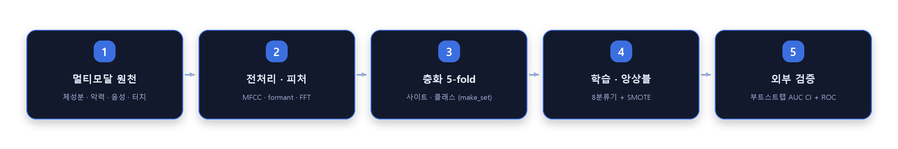
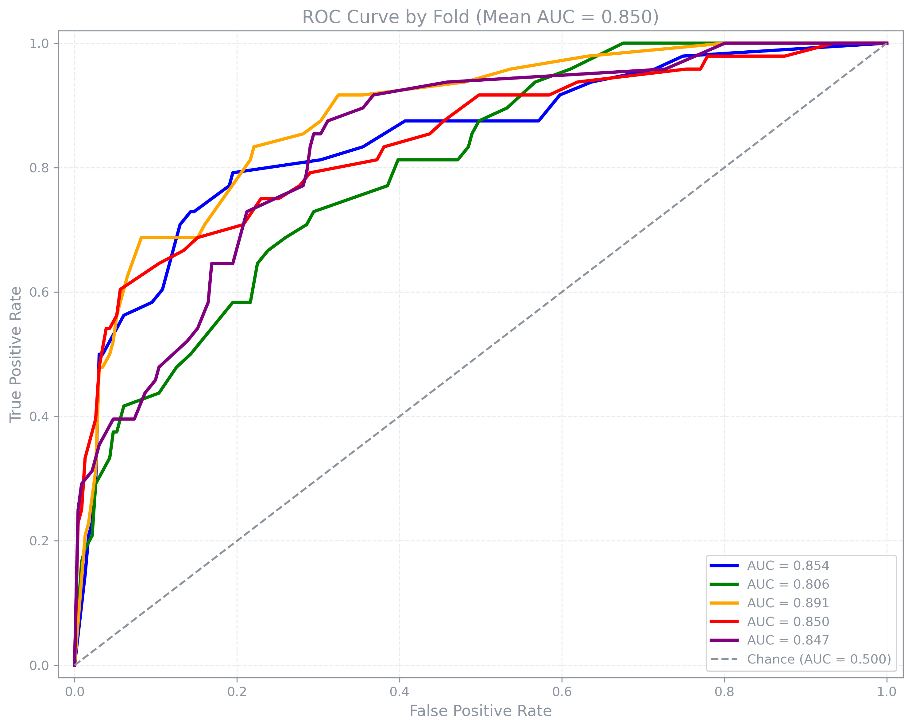

<p align="center">
  
</p>

<div align="center">

# 근감소증 예측 멀티모달 ML

**체성분(InBody)·악력·음성·터치 상호작용 피처로 근감소증(sarcopenia)을 비침습적으로 분류하고, 다기관 외부 검증으로 일반화 성능을 확인하는 임상 ML 파이프라인**


</div>

> **🔒 데이터 거버넌스** — 실제 피험자 데이터(체성분·인지·악력 검사표, 음성 녹음, 병원 코드 ID)는
> 이 저장소에 **일절 포함되지 않습니다.** 원본은 3개 의료기관의 다기관 임상 데이터로 개발되었고,
> 여기서는 병원명을 `SITE_A/B/C`로 익명화하고 동일 스키마의 **합성 데이터 생성기**
> (`data/make_synthetic.py`)로 전체 학습·평가 파이프라인을 재현합니다.
> 아래 ROC와 성능표는 모두 합성 데이터로 재생성한 것이며, 실데이터 기준 수치는 표에 병기했습니다.

---

## 1. 문제

근감소증은 조기 발견이 중요하지만 표준 진단(DXA, InBody)은 장비·비용 부담이 큽니다. 목표는
**앱으로 수집 가능한 비침습 신호만으로 근감소증을 선별**하고, 다른 병원 데이터에서도 성능이
유지되는지(**외부 검증**) 확인하는 것입니다. 임상 채택 기준으로 민감도·특이도 하한선을 두고,
그 하한선을 만족하는지 **이항 신뢰구간(binomial CI)**으로 판정합니다.

## 2. 파이프라인

<p align="center">
  
</p>

## 3. 외부(확증) 검증 결과

학습에 쓰이지 않은 별도 사이트 데이터로 5-fold 모델을 평가합니다. `placebo` 없이도 **특이도가
안정적으로 높고**(불필요한 양성 최소화), fold별 부트스트랩 AUC 신뢰구간을 함께 보고합니다.



## 4. 모델 성능 (외부 검증)

| 지표 | 실데이터 (3개 기관) | 합성 데이터 (재현) |
|---|---|---|
| **AUC** (fold 평균) | **0.968** | 0.850 |
| 정확도 | 0.933 | 0.867 |
| 민감도 (pooled) | 0.837 | 0.346 |
| 특이도 (pooled) | 0.947 | 0.975 |
| F1 | 0.821 | 0.466 |

> 합성 데이터는 스키마·파이프라인 재현이 목적이라 신호 강도가 실데이터보다 약합니다(특히 민감도).
> 실데이터에서는 민감도 하한선(0.37)·특이도 하한선(0.89)을 모두 만족했습니다.

## 5. 방법론 하이라이트

- **8종 분류기 + 투표 앙상블** — LR·NB·KNN·DT·SVM·**CatBoost**·GBDT·LightGBM을 그리드서치로 학습, hard/soft voting 앙상블
- **클래스 불균형 처리** — SMOTE 오버샘플링 + `class_weight`/CatBoost 동적 가중치 (유병률 ~15%)
- **모델 선택** — 검증셋에서 `0.6·AUC + 0.3·F1 + 0.1·MCC` 복합 점수 + **Youden-J** 임계값 튜닝
- **엄밀한 불확실성 보고** — 민감도·특이도에 **이항 95% CI**(per-fold + pooled), AUC에 **부트스트랩 95% CI**, 임상 하한선 대비 PASS/FAIL 판정
- **다기관 외부 검증** — 학습에 없던 사이트로 일반화 성능 확인 (`external_eval.py`)

## 6. Quickstart

```bash
pip install -r requirements.txt

python data/make_synthetic.py   # 1) 합성 데이터 생성 (datasetA 283명 + external 279명)
python demo_train.py            # 2) 5-fold GBDT 학습 → CV 평가 → 외부 검증 + ROC
```

`demo_train.py`가 `ml_manager`(학습/CV/CI)와 `external_eval`(외부 검증/부트스트랩/ROC)를
합성 데이터로 엔드투엔드 실행합니다.

## 7. 코드 맵

| 파일 | 역할 |
|---|---|
| `ml_manager.py` | 핵심 ML 엔진 — fold 데이터 로더, 그리드서치 학습, 임계값 최적화, 앙상블, CV 평균 + 이항 CI |
| `external_eval.py` | 외부 검증 하네스 — 5-fold 모델 로드, 부트스트랩 AUC CI, fold별·pooled 지표, ROC PNG |
| `make_set.py` | 사이트·클래스 층화 데이터셋 빌더 (5-fold 배정) |
| `threshold_utils.py` | 임계값 테이블, Youden-J / 목표 민감도 기준 선택, ROC |
| `eval_tool.py` | 지표 계산 (Acc/Sen/Spe/PPV/NPV/F1, MCC, ROC/AUC) |
| `preprocess_audio.py` | 음성 전처리 — 무음 제거, mel-spectrogram, pitch/intensity/formant, MFCC 등 → 과제별 CSV |
| `feature_extraction/` | 터치/스와이프 기록 FFT 피처 |
| `common.py` | 인프라 유틸 (pickle I/O, INI 설정, 로거, 멀티프로세싱 배치) |
| `data/make_synthetic.py` | 합성 샘플 데이터 생성기 (이 저장소의 유일한 데이터 소스) |
| `demo_train.py` | 합성 데이터 엔드투엔드 데모 |

## 8. 사용 피처

최종 컴팩트 피처셋 (10개): `SEX, Age, Weight, BMI, SMI, IBgrip_MAX` + 터치/스와이프 4종
(`swipe_horizontal_rms_distance`, `touch_horizontal_one_press_consistency`,
`touch_horizontal_one_left_mean`, `touch_horizontal_two_balance_ratio`). 음성 파이프라인은
MFCC·chroma·spectral contrast·pitch·formant 등 확장 피처를 별도로 추출합니다.

---

<sub>이 저장소는 포트폴리오 열람용입니다. 실무 임상 연구에서 피험자 데이터·병원 식별자·학습된 모델을
제거하고 익명 사이트 코드와 합성 데이터로 재구성했습니다. 임상 사용을 위한 도구가 아닙니다.</sub>

---

<!-- portfolio-footer -->

### 🗂️ 포트폴리오

이 저장소는 포트폴리오의 일부입니다. → **[전체 프로젝트 보기](https://github.com/sungjin-ahn-dev)**

- [MOCO — AI Coworker Platform](https://github.com/sungjin-ahn-dev/moco-ai-coworker)
- **근감소증 예측 멀티모달 ML** ← 현재 저장소
- [DTx 인지훈련 난이도 조정 봇](https://github.com/sungjin-ahn-dev/dtx-adaptive-training-bot)
- [한국어 난독증 읽기평가 엔진](https://github.com/sungjin-ahn-dev/korean-reading-assessment)
- [AICC 음성 상담 서버](https://github.com/sungjin-ahn-dev/aicc-voice-agent)
